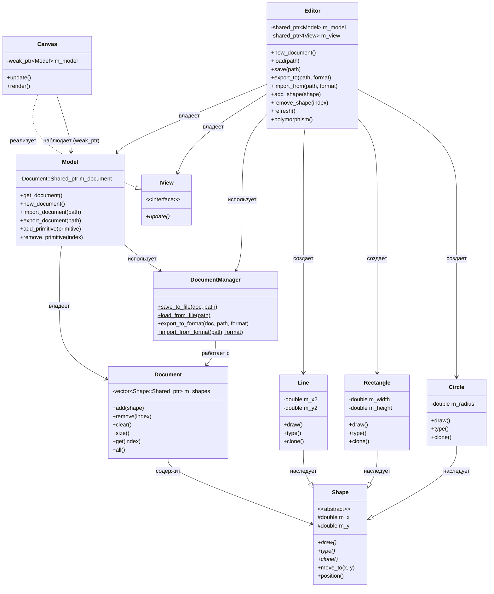
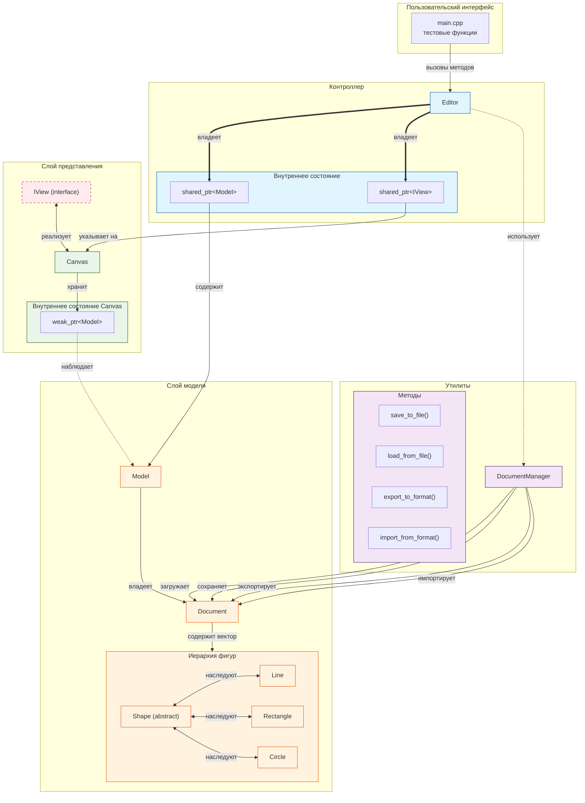

## Диаграмма классов

```mermaid
classDiagram
    class Editor {
        -shared_ptr&lt;Model&gt; m_model
        -shared_ptr&lt;IView&gt; m_view
        +new_document()
        +load(path)
        +save(path)
        +export_to(path, format)
        +import_from(path, format)
        +add_shape(shape)
        +remove_shape(index)
        +refresh()
        +polymorphism()
    }

    class Model {
        -Document::Shared_ptr m_document
        +get_document()
        +new_document()
        +import_document(path)
        +export_document(path)
        +add_primitive(primitive)
        +remove_primitive(index)
    }

    class Document {
        -vector&lt;Shape::Shared_ptr&gt; m_shapes
        +add(shape)
        +remove(index)
        +clear()
        +size()
        +get(index)
        +all()
    }

    class IView {
        &lt;&lt;interface&gt;&gt;
        +update()*
    }

    class Canvas {
        -weak_ptr&lt;Model&gt; m_model
        +update()
        +render()
    }

    class DocumentManager {
        +save_to_file(doc, path)$
        +load_from_file(path)$
        +export_to_format(doc, path, format)$
        +import_from_format(path, format)$
    }

    class Shape {
        &lt;&lt;abstract&gt;&gt;
        #double m_x
        #double m_y
        +draw()*
        +type()*
        +clone()*
        +move_to(x, y)
        +position()
    }

    class Line {
        -double m_x2
        -double m_y2
        +draw()
        +type()
        +clone()
    }

    class Rectangle {
        -double m_width
        -double m_height
        +draw()
        +type()
        +clone()
    }

    class Circle {
        -double m_radius
        +draw()
        +type()
        +clone()
    }

    Editor --> Model : владеет
    Editor --> IView : владеет
    Editor --> DocumentManager : использует
    Editor --> Line : создает
    Editor --> Rectangle : создает
    Editor --> Circle : создает

    Model --> Document : владеет
    Model --> DocumentManager : использует

    Document --> Shape : содержит
    
    Canvas ..|> IView : реализует
    Canvas --> Model : наблюдает (weak_ptr)
    
    Line --|> Shape : наследует
    Rectangle --|> Shape : наследует
    Circle --|> Shape : наследует

    DocumentManager --> Document : работает с
```

## Взаимодействие компонентов

```mermaid
flowchart TB
    subgraph UI [Пользовательский интерфейс]
        main["main.cpp<br>тестовые функции"]
    end

    subgraph Controller [Контроллер]
        Editor["Editor"]
        
        subgraph Editor_Internal [Внутреннее состояние]
            m_model["shared_ptr&lt;Model&gt;"]
            m_view["shared_ptr&lt;IView&gt;"]
        end
    end

    subgraph ModelLayer [Слой модели]
        Model["Model"]
        Document["Document"]
        
        subgraph Shapes [Иерархия фигур]
            Shape["Shape (abstract)"]
            Line["Line"]
            Rect["Rectangle"]
            Circle["Circle"]
        end
    end

    subgraph ViewLayer [Слой представления]
        IView["IView (interface)"]
        Canvas["Canvas"]
        
        subgraph Canvas_Internal [Внутреннее состояние Canvas]
            weak_model["weak_ptr&lt;Model&gt;"]
        end
    end

    subgraph Utils [Утилиты]
        DocManager["DocumentManager"]
        
        subgraph DocManager_Internal [Методы]
            save["save_to_file()"]
            load["load_from_file()"]
            export_f["export_to_format()"]
            import_f["import_from_format()"]
        end
    end

    %% Связи между компонентами
    main -->|вызовы методов| Editor
    
    Editor ===>|владеет| m_model
    Editor ===>|владеет| m_view
    Editor -.->|использует| DocManager
    
    m_model -->|содержит| Model
    m_view -->|указывает на| Canvas
    
    Model -->|владеет| Document
    Document -->|содержит вектор| Shapes
    
    Shape <-->|наследуют| Line
    Shape <-->|наследуют| Rect
    Shape <-->|наследуют| Circle
    
    IView <-->|реализует| Canvas
    Canvas -->|хранит| weak_model
    weak_model -.->|наблюдает| Model
    
    DocManager -->|загружает| Document
    DocManager -->|сохраняет| Document
    DocManager -->|экспортирует| Document
    DocManager -->|импортирует| Document

    %% Стили для наглядности
    classDef controller fill:#e1f5fe,stroke:#01579b
    classDef model fill:#fff3e0,stroke:#e65100
    classDef view fill:#e8f5e8,stroke:#1b5e20
    classDef utils fill:#f3e5f5,stroke:#4a148c
    classDef interface fill:#ffebee,stroke:#b71c1c,stroke-dasharray: 5 5
    
    class Editor,Editor_Internal controller
    class Model,Document,Shapes,Shape,Line,Rect,Circle model
    class IView,Canvas,Canvas_Internal view
    class DocManager,DocManager_Internal utils
    class IView interface
```